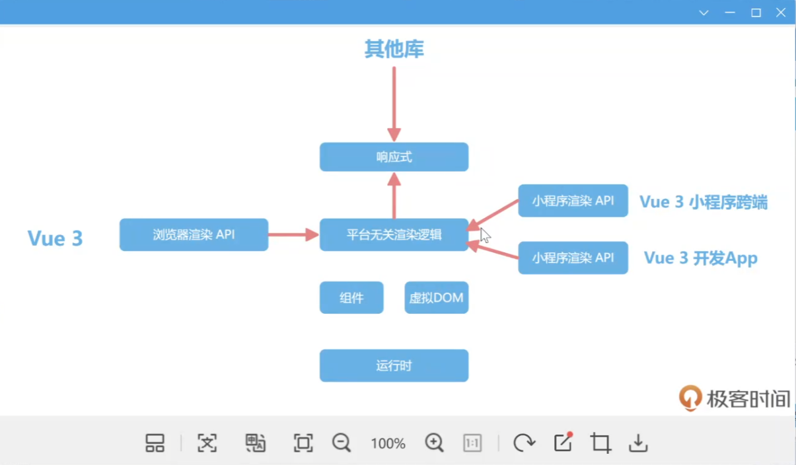

# SSR 服务器端渲染

-  网页请求
    - index.html root挂载点 script  main.js
        vue js
    - 对SEO十分不友好
        爬虫只会爬取index.html,不能够爬js并执行
    - PC or Mobile  
        PC端流量来自百度 SEO非常重要
        Mobile 来自链接分享， App的内嵌页， SEO没那么重要 VUE SPA  CSR（Client Side Rendering 客户端渲染）
    - PC站 Google/baidu  SSR（Server Side Rendering 服务端渲染）

    - VUE 可以在服务器端运行不?
        

    ``平台无关渲染逻辑``
        - VUE除了客户端渲染挂载不能做之外，其他的都要以服务器端运行
        - 响应式/组件/虚拟DOM 可以在node 环境运行
        - 虚拟DOM渲染为何种界面，可以由平台决定
             uniapp 小程序
             html
        - 怎么样生成SEO?
            界面内容以界面需要的String返回
            爬虫就能拿到
- CSR SSR 平台无关性渲染 
    vue@/server-renderer VDOM -> 渲染字符串
    
        